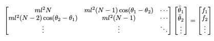

# 2D Simulation of Wheat Strands Dynamics with Frictional Contact in Wind-Driven Fields

## `Goal` : 
Develop a 2D simulation model for the dynamic behavior of wheat strands in wind-driven fields, incorporating realistic rendering, Lagrangian dynamics, and interactions between multiple strands, including friction and contact forces. Validate the simulation against real-world observations to ensure accuracy and applicability.
## `Steps of the project`

### I - Rendering of a strand as a system of rods 

<p align="center">
  
</p>

Here is the code that generated the strand above

```python
def strand_creator(x0, l, theta):
    positions0 = np.array([x0] + 3*[0.], np.float64)
    positions0[2], positions0[3] = x0 + l*np.sin(theta[0]), -l*np.cos(theta[0])
    rods = [Rod2D(positions0, colours)]
    viewer.addRenderable(Rod2DRenderable(rods[0], thickness=0.005))
    for i in range(1, N):
        positions = np.zeros(4)
        positions[0], positions[1] = rods[i-1].positions[2], rods[i-1].positions[3] 
        positions[2], positions[3] = positions[0]+l*np.sin(theta[i]), positions[1]-l*np.cos(theta[i])
        rod = Rod2D(positions, colours)
        rodRenderable = Rod2DRenderable(rod, thickness=0.005)
        viewer.addRenderable(rodRenderable)
        rods.append(rod)
    return rods
```

### II - Implementing the lagrangian dynamic of one strand

Let $N$ be the number of degrees of freedom of the strand, and $\Theta = [\theta_1 \theta_2 ... \theta_N]$ the angles defining the articulation of rods.

Let us start by enumerating all the forces in our system : $F = F_{gravity} + F_{wind} + F_{Rayleigh} + F_{spring}$

*Naive approach :* sinusoidal forced wave to simulate the wind (Thus two params $\gamma$ : amplitude and $\omega$ : frequency)


$$
\vec{F_{\text{wind}}}(t) = -\gamma \sin(\omega t)\vec{e_x}
$$

$$Ep_{wind} =-\gamma sin(\omega t)(N-s+1)lcos\theta_s x_1 - ... -\gamma sin(\omega t) x_N  $$

$$ x_j = lsin\theta_1 + ...+ lsin\theta_j $$

$$ \frac{\partial Ep_{wind}}{\partial {\theta_{s}}} = -\gamma sin(\omega t)(N-s+1)lcos\theta_s$$

Also so that we integrate damping of oscillations in our simulation, we used **Rayleigh Damping**

$$D_r = \frac{1}{2}\sum_i \beta_i (\dot x_i^2 + \dot y_i^2)$$

We compute : $$\frac{\partial D_r}{\partial \dot\theta_s} = \beta \sum_{j=s}^N l(cos\theta_s \dot x_j + sin\theta_s \dot y_j)$$

$$\sum_{j \leq s} \beta l N cos(\theta_j - \theta_s)\dot\theta_j+ \sum_{j > s} \beta l (N-j+s) cos(\theta_j - \theta_s)\dot\theta_j$$

**Lagrangian Theorem** : 
$$\forall s = 1, ..., N : \frac{dp_{\theta_{s}}}{dt} - \frac{\partial L}{\partial \theta_{s}} = 0$$

Where $p_{\theta_{s}} = \frac{\partial L}{\partial \dot{\theta_{s}}}$ and $L = T - V$

- $L$ is the lagrangian of the system 
- $T$ is the kinetic energy of the system
- $V$ is the potential energy of the system

Note that 
$$
\begin{align*}
x_{1} &= l\sin\theta_{1}\\
y_{1} &= -l\cos\theta_{1}\\
x_{i} &= x_{i-1} + l\sin\theta_{i}\\
y_{i} &= y_{i-1} - l\cos\theta_{i}\\
\end{align*}
$$

Kinetic : 

$$T = \frac{1}{2}mv_{1}^2 + ... + \frac{1}{2}mv_{N}^2$$

$$T = \frac{1}{2}m(\dot{x}_{1}^2 + \dot{y}_{1}^2) + ... + \frac{1}{2}m(\dot{x}_{N}^2 + \dot{y}_{N}^2)$$

$$\frac{\partial T}{\partial {\theta_{s}}} = ml\sum_{j=s}^{N}[- \dot{\theta_{s}}sin(\theta_{s})\dot{x_{j}} + \dot{\theta_{s}}cos(\theta_{s})\dot{y_{j}}]$$

Potential : 

$$
V = mgy_{1}+...+mgy_{N} - K(\theta_1-\pi)^2 - ... - K(\theta_N-\pi)^2  + Ep_{wind} + Ep_{Rayleigh}\\$$

$$\text{Explanation: The term } mgy_i \text{ represents the potential energy due to \textbf{gravity}}$$

$$\text{The term } K(\theta_i - \pi)^2 \text{ represents the potential energy due to the \textbf{springs action}  where $K$ is the rigidity spring constant and $\pi$ is the equilibrium angular position.}\\$$

Remarques : 

$$y_{i} = -lcos\theta_1 - ... -lcos\theta_N$$
$$\frac{\partial y}{\partial \theta_{s}} = \begin{cases}
        lsin\theta_{s} & \text{if } s \leq i, \\
        0 & \text{otherwise}.
    \end{cases}$$

$$\frac{\partial V}{\partial \dot{\theta_{s}}} = 0$$


$$\forall s: p_{\theta_{s}} = \frac{\partial L}{\partial \dot{\theta_{s}}} = ml\sum_{j=s}^{N}[cos(\theta_{s})\dot{x_{j}} + sin(\theta_{s})\dot{y_{j}}]$$

$$\frac{dp_{\theta_{s}}}{dt} = ml\sum_{j=s}^{N}[cos(\theta_{s})\ddot{x_{j}} + sin(\theta_{s})\ddot{y_{j}} - \dot{\theta_{s}}sin(\theta_{s})\dot{x_{j}} + \dot{\theta_{s}}cos(\theta_{s})\dot{y_{j}}]$$

$$\frac{\partial L}{\partial \theta_{s}} = ml\sum_{j=s}^{N}[- \dot{\theta_{s}}sin(\theta_{s})\dot{x_{j}} + \dot{\theta_{s}}cos(\theta_{s})\dot{y_{j}}] - (N-s+1)mglsin(\theta_{s}) - 2K(\theta_s-\pi) - \gamma \sin(\omega t) (l\sin\theta_s - x_{ref})s$$

$$\frac{dp_{\theta_{s}}}{dt} - \frac{\partial L}{\partial \theta_{s}} = 0 \iff ml\sum_{j=s}^{N}[cos(\theta_{s})\ddot{x_{j}} + sin(\theta_{s})\ddot{y_{j}}] + (N-s+1)mglsin(\theta_{s}) + 2K(\theta_s-\pi) + \gamma \sin(\omega t) (l\sin\theta_s - x_{ref})s = 0$$

$$ml^2(N-s+1)\ddot{\theta_s} + \sum_{j \neq s}^N ml^2(N-s)cos(\theta_j - \theta_s)\ddot{\theta_j} = -[(N-s+1)mglsin\theta_s + ml(N-s)\sum_{j \neq s}^N \dot{\theta_j}^2 sin(\theta_j - \theta_s) + 2K(\theta_s-\pi) + \gamma \sin(\omega t) (l\sin\theta_s - x_{ref})s]$$

We can rewrite this in its matrix form 



Where $$f_s = -[(N-s+1)mglsin\theta_s + ml(N-s)\sum_{j \neq s}^N \dot{\theta_j}^2 sin(\theta_j - \theta_s) + 2K(\theta_s-\pi) + \gamma \sin(\omega t) (l\sin\theta_s - x_{ref})s + ]$$

So far, we found that the dynamic of a strand (approximated by an articulated system of pendulums and springs) subject to external forces (wind, gravity and rayleigh damping) is given by $M\ddot\Theta=F$ where $M$ is called mass/inertia matrix of the strand/solid


### III - Testing the rendering and dynamic with multiple strands
Parameters choosed : 
- $m = 15$ (Number of strands)
- $N = 6$ (Number of rods / degrees of freedom)
- $\theta_{1:N}^0 = \frac{7\pi}{8}$ (Initial angles)


### IV - Friction and contact between strands during the dynamic


## `Project Organization`

- `brin_blé.py`: Main source code file containing the simulation
- `geom/`: Folder containing geometry objects
- `graphics/`: Folder containing renderable objects, shader ...
- `mesh/`: Folder containing mesh obj
- `dynamics/`: Folder containing dynamics classes
- `pydfcp/`: Folder containing DFCP optimizer


## `Next step`
- Enhance collision detection speed by implementing optimized algorithms such as Sweep and Prune.
- Previously, we approximated a stream using an articulated system of multiple pendulums and springs. Now, let's explore another sophisticated approximation and compare the results.
- Expand the simulation from 2D to 3D.
- SoTA of wind chaotic dynamic .. (complex topic apparently)
