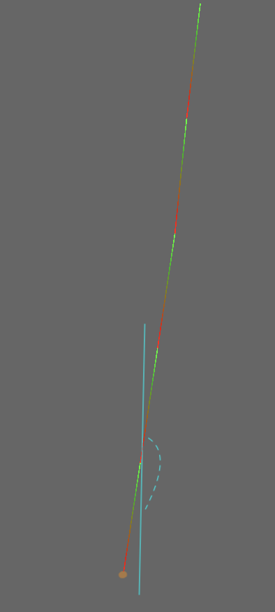

# 2D Simulation of Wheat Strands Dynamics with Frictional Contact in Wind-Driven Fields

## `Goal` : 
Develop a 2D simulation model for the dynamic behavior of wheat strands in wind-driven fields, incorporating realistic rendering, Lagrangian dynamics, and interactions between multiple strands, including friction and contact forces. Validate the simulation against real-world observations to ensure accuracy and applicability.
## `Steps of the project`

### I - Rendering of a strand as a system of rods 

<p align="center">
  
</p>

Here is the code that generated the strand above

```python
def strand_creator(x0, l, theta):
    positions0 = np.array([x0] + 3*[0.], np.float64)
    positions0[2], positions0[3] = x0 + l*np.sin(theta[0]), -l*np.cos(theta[0])
    rods = [Rod2D(positions0, colours)]
    viewer.addRenderable(Rod2DRenderable(rods[0], thickness=0.005))
    for i in range(1, N):
        positions = np.zeros(4)
        positions[0], positions[1] = rods[i-1].positions[2], rods[i-1].positions[3] 
        positions[2], positions[3] = positions[0]+l*np.sin(theta[i]), positions[1]-l*np.cos(theta[i])
        rod = Rod2D(positions, colours)
        rodRenderable = Rod2DRenderable(rod, thickness=0.005)
        viewer.addRenderable(rodRenderable)
        rods.append(rod)
    return rods
```

### II - Implementing the lagrangian dynamic of one strand

### III - Testing the rendering and dynamic with multiple strands
Parameters choosed : 
- m = 15 (Number of strands)
- N = 6 (Number of rods / degrees of freedom)
- $\theta_{1:N}^0 = \frac{7\pi}{8}$ (Initial angles)


### VI - Forced wind 
adding a sinusoidal forced wave to simulate the wind (naive approach)


### V - Friction and contact between strands during the dynamic


## `Project Organization`

- `brin_blé.py`: Main source code file containing the simulation
- `geom/`: Folder containing geometry objects
- `graphics/`: Folder containing renderable objects, shader ...
- `mesh/`: Folder containing mesh obj
- `dynamics/`: Folder containing dynamics classes
- `pydfcp/`: Folder containing DFCP optimizer


## `Next step`
- Enhance collision detection speed by implementing optimized algorithms such as Sweep and Prune.
- Previously, we approximated a stream using an articulated system of multiple pendulums and springs. Now, let's explore another sophisticated approximation and compare the results.
- Expand the simulation from 2D to 3D.
- SoTA of wind chaotic dynamic .. (complex topic apparently)
